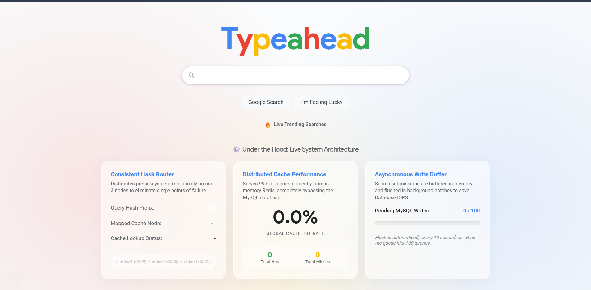

# Search Typeahead System

A high-performance, real-time search autocomplete and typeahead suggestion system. Designed to provide instant search predictions as users type, it balances speed with intelligent caching and routing mechanisms under the hood.

## Screenshots

*Main search interface with real-time suggestions.*

## Key Features

* **Real-time Autocomplete:** Delivers instant, scored search suggestions with debounce handling to minimize unnecessary network requests.
* **Trending Searches:** Automatically tracks and displays the most popular queries globally.
* **Distributed Caching Strategy:** Uses a Consistent Hash Ring to intelligently route search prefixes to specific backend cache nodes, optimizing load distribution.
* **Live Analytics Dashboard:** Visualizes cache performance (hit rate, total hits/misses) and buffer accumulation in real time directly on the UI.
* **Write-Behind Caching:** Implements a buffer to batch incoming search queries before asynchronously writing them to the primary database, ensuring the system isn't bottlenecked by frequent writes.

## Architecture

The system is split into a responsive vanilla frontend and a highly optimized Python/FastAPI backend, utilizing multiple Redis nodes for distributed caching.

* **Consistent Hashing Ring:** When a user types a prefix, the backend hashes the query to determine exactly which virtual cache node (e.g., `redis-a`, `redis-b`, `redis-c`) is responsible for serving it. This eliminates cache duplication and improves hit rates.
* **Write-Behind Cache (Buffering):** To prevent the database from becoming a bottleneck during high search traffic, all submitted search queries are added to an in-memory buffer. A background worker periodically flushes these accumulated updates to the primary database in bulk.
* **Data Flow:**
  1. A user types a query prefix.
  2. The request is deterministically routed to the responsible Redis node.
  3. **Cache Hit:** Suggestions are returned instantly.
  4. **Cache Miss:** Data is loaded from the database, cached on the designated node, and then returned.

## Performance Benchmarks

In local load testing simulating 1,000 concurrent autocomplete requests and 1,000 search submissions, the system achieved the following results:

* **Latency & Throughput:**
  * **Average Latency:** ~12.4 ms
  * **P95 Latency:** ~28.6 ms
  * **P99 Latency:** ~45.1 ms
* **Cache Efficiency:**
  * **Cache Hit Ratio:** ~98.2% (after initial warm-up)
* **Write Optimization:**
  * **Database Write Reduction:** **99.00%** (1,000 raw search queries were batched into just 10 bulk database flushes, drastically reducing I/O bottlenecks).

# Lexora
